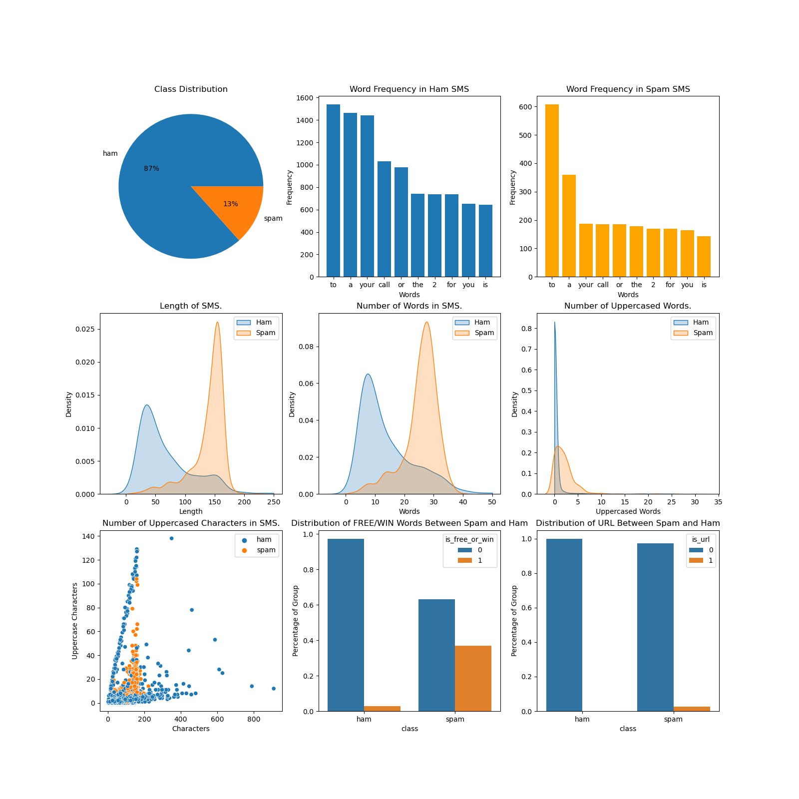

# Serving a ML trained model over HTTP through Flask API

Before deploying a machine learning model, we need…a machine learning model. In this case, a state-of-the-art model has been built using scikit-learn to address the task of SMS Spam Filtering, which is available in this repository.

The [SMS Ham-Spam detection dataset](SMSSpamCollection) is a collection of tagged SMS messages that have been gathered for SMS Spam research. It consists of a set of 5,574 SMS messages in English, including both training and testing data. The tagging standard was defined as `ham` (legitimate) or `spam`.

The `train` and `test` files are formatted using the standard of one message per line. Each line is composed by two columns: one with label (`ham` or `spam`) and other with the raw text. Here are some examples:


```
ham   What you doing?how are you?
ham   Ok lar... Joking wif u oni...
ham   dun say so early hor... U c already then say...
ham   MY NO. IN LUTON 0125698789 RING ME IF UR AROUND! H*
ham   Siva is in hostel aha:-.
ham   Cos i was out shopping wif darren jus now n i called him 2 ask wat present he wan lor. Then he started guessing who i was wif n he finally guessed darren lor.
spam   FreeMsg: Txt: CALL to No: 86888 & claim your reward of 3 hours talk time to use from your phone now! ubscribe6GBP/ mnth inc 3hrs 16 stop?txtStop
spam   Sunshine Quiz! Win a super Sony DVD recorder if you canname the capital of Australia? Text MQUIZ to 82277. B
spam   URGENT! Your Mobile No 07808726822 was awarded a L2,000 Bonus Caller Prize on 02/09/03! This is our 2nd attempt to contact YOU! Call 0871-872-9758 BOX95QU

```

## Build

To build the project, run the following commands:

```
export epoch=$(date +%s)
export version=AutoML_$epoch
echo "version: $version"

docker build --build-arg VERSION=$version -t flask-predict .
```

This will create a docker image named 'flask-predict' with the specified version number.


## Run

To run the project, execute the following command:

```
docker run -p 5000:5000 -d flask-predict
```

This will start the Flask API server in a docker container, and it can be accessed by navigating to http://localhost:5000 in a web browser.


sample message that will be classified as spam:

`ASKED 3MOBILE IF 0870 CHATLINES INCLU IN FREE MINS. INDIA CUST SERVs SED YES. L8ER GOT MEGA BILL. 3 DONT GIV A SHIT. BAILIFF DUE IN DAYS. I O £250 3 WANT £800`

## Data Analysis

The data analysis image shows a visual representation of the SMS Ham-Spam dataset, which can be used to gain insights into the dataset and inform modeling decisions.


